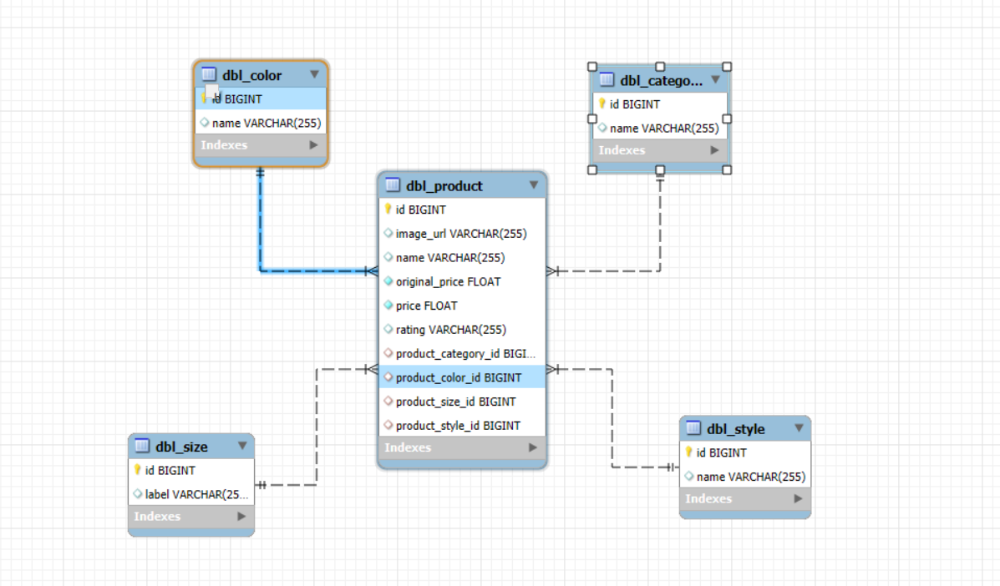

# HaibazoShop 

# Features:
- CRUD api
- Paging and sorting products
- Search products by category, size, color, style

# How to run
- Clone this repository
- Make sure you are using JDK 21
- Install extension [Lombok](https://projectlombok.org/) in IntelliJ IDEA

## Run by Application 
- Step 1: Install MySql Workbench
    - Import file `haibazoShop.sql` in folder `Database`
    - Database design (ERD)
    
- Step 2: Install maven and Jdk in computer
- Step 3: Change config in file application.properties
- Finally: Run application in intelliJ or run application in Command Prompt
## Test API by postman
- Install Postman application
- Import file `haibazoShop.postman_collection.json` in folder `Postman`